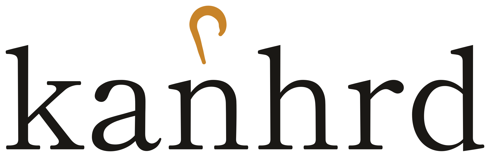

<h1 align="center">
  <picture>
    <source media="(prefers-color-scheme: dark)" srcset="docs/assets/wordmark-dark.svg">
    
  </picture>
</h1>

_watch the flock, tend the ones that stop._

kanban + herdr — a web UI for [herdr](https://github.com/herdrdev/herdr) that puts every agent conversation on a single kanban board, across all your machines.

> **Status: alpha.** The board, the live terminal, and full pane/tab/workspace lifecycle work today. Interfaces still move without notice, and there is no upgrade path between versions yet.

## What it is

herdr runs coding agents in terminal panes, one machine at a time, driven from a TUI. kanhrd is a browser client for herdr: it talks to one or more herdr instances over their JSON socket API and renders every pane as a card on a kanban board, grouped into columns by agent status (Idle, Working, Blocked, Done, Unknown). If you run herdr on more than one machine, kanhrd gives you one board instead of N terminal sessions to check on.

## Read this before you expose it

**The bridge has no authentication of its own.** It ships no login page, no password, no token. Anyone who can open its port gets a live terminal on every machine you have pointed it at, running as you — that is a remote shell on your dev machines, not a read-only dashboard.

Two things keep that safe:

1. **The bridge binds `127.0.0.1` by default** and refuses any other bind address unless you pass `--i-know-what-im-doing`. That flag is the whole safety interlock; `make run-exposed` and editing the Docker port mapping to `0.0.0.0` both defeat it deliberately.
2. **Identity is delegated to a reverse proxy** in front of the bridge — Tailscale, oauth2-proxy, Cloudflare Access, or equivalent. If you expose kanhrd beyond loopback without one of those, it is unauthenticated. See [ADR-0003](docs/adr/0003-delegated-auth-with-loopback-default.md) for why the bridge owns no credentials.

`make run-tailscale` and `make run-tailscale-serve` are the safe non-loopback recipes on a laptop. Full detail: [`SECURITY.md`](SECURITY.md), [`docs/THREAT-MODEL.md`](docs/THREAT-MODEL.md), and the per-placement recipes in [`docs/OPERATING.md`](docs/OPERATING.md). Report vulnerabilities per [`SECURITY.md`](SECURITY.md) rather than in a public issue.

## What you can do today


- **One board across every host.** Panes from every configured herdr socket land on the same board, grouped by agent status, with host chips and filters to narrow it.
- **A live terminal per card.** Click a card and get a real xterm.js terminal for that pane — output streams in, typing goes back out (printable text via `pane.send_text`, control keys via `pane.send_keys`).
- **Lifecycle from the board.** Create, split and close panes; create, rename and close tabs and workspaces. Destructive actions preview exactly what they will close first, including linked-worktree groups that cascade.
- **A navigator rail.** A live tree of workspaces and tabs beside the board, kept in sync from herdr's own lifecycle events. The URL is the state, so a view is linkable.
- **Keyboard-first.** Chord and single-key bindings for navigation, lifecycle and view, with `?` for the shortcut reference.
- **Settings that stick.** Light/dark app theme, board density, terminal font size, and six terminal palettes (washi, sumi, catppuccin mocha, monokai, solarized dark and light) plus an `auto` that follows the app theme.
- **Mobile.** The board is usable on a phone, not merely responsive.

### Known gaps

These are herdr-side limits, not to-dos:

- **No PTY resize.** herdr has no public API to set a pane's dimensions from an external client, so `pane.resize` is always rejected. xterm.js resizes freely in the browser; herdr keeps its own dimensions.
- **No agent-drawn graphics capture.** herdr's `pane.graphics.*` API pushes overlay images onto a pane; it is not a read path for an agent's own kitty-graphics or sixel output.

kanhrd probes `bridge.capabilities` per verb, so a bridge missing an optional feature degrades gracefully instead of breaking the connection. See the Capabilities section of [`docs/CONTEXT.md`](docs/CONTEXT.md).

### More screenshots

Every capture below is generated by `make screenshots` from a fully mocked bridge: no herdr, no operator socket, a fixed 600-pane fixture and a frozen clock. (The phone shot above is the exception — it is taken by hand against a live herdr, because the mocked bridge advertises tier-1 and so cannot render the create button, the card actions or real elapsed times.) Each shot is taken twice and discarded unless the two are byte-identical, so regenerating them does not churn Git LFS. See [`apps/web/e2e/capture.spec.ts`](apps/web/e2e/capture.spec.ts).

| | |
| --- | --- |
|  | **The board.** Panes from every configured host in one place, grouped by agent status, with host chips and status filters above. |
|  | **A live terminal per card.** Real xterm.js, output streaming in and typing going back out. |
|  | **The rail is a navigator, not a filter.** Scoping into a workspace changes the URL, so the view is linkable. |
|  | **Density it survives.** 600 panes across three hosts; cards drop to a compact row past 20 in a column. |
|  | **Settings that stick.** App theme, board density, terminal palette and text size, all persisted locally. |
|  | **Empty states are next steps.** With no hosts configured, the board hands over the exact config to paste. |


**Six terminal palettes.** One palette for every open terminal — cards are told apart by title, host seal and status, never by terminal colour. Composited from six separate captures, one per palette.

## Why

Two web UIs for herdr already exist — [`herdr-web`](https://github.com/eyalev/herdr-web) (Node bridge, SGR-to-DOM terminal rendering, localhost-only, mobile-focused) and [`herdr-webui`](https://github.com/alecuba16/herdr-webui) (Rust/Axum with a ghostty renderer, single-host, terminal-workspace-centric). Neither offers a kanban view, and neither is built for watching agents across multiple hosts at a glance. kanhrd exists to fill that gap — see [ADR-0002](docs/adr/0002-greenfield-vs-forking-existing-web-uis.md) for why it's a new codebase rather than a fork of either.

## Architecture at a glance

```text
 Browser (Angular SPA)
        │  HTTP + WebSocket
        ▼
 kanhrd bridge (Node/TS) ── single process, one endpoint
        │
        ├── local herdr socket ──────────────► herdr (this machine)
        │
        └── SSH-forwarded socket ────────────► herdr (remote machine)
             (forward or reverse tunnel,
              lifecycle managed outside the bridge:
              autossh / systemd)
```

- **Bridge** (`apps/bridge`, Node/TS) — the only thing the browser talks to. Serves the built SPA, proxies JSON-socket traffic from every configured herdr host over one WebSocket, and exposes a small REST fallback for one-shot calls.
- **Web app** (`apps/web`, Angular) — the SPA: board, terminal detail, lifecycle, rail, settings.
- **Schema** (`packages/schema`) — the wire types both sides share.
- **herdr JSON socket** — each herdr host's existing local API (`~/.config/herdr/herdr.sock`); the bridge is a client of it, not a fork of it.
- **SSH tunnels** — how a remote herdr socket becomes reachable to the bridge as if it were local. See [ADR-0001](docs/adr/0001-hub-bridge-ssh-tunnels.md) and [`docs/OPERATING.md`](docs/OPERATING.md).

The SPA's visual layer is governed by three design docs, binding on any change to `apps/web`: [`docs/BRAND.md`](docs/BRAND.md) (identity and voice), [`docs/DESIGN-SYSTEM.md`](docs/DESIGN-SYSTEM.md) (the token contract), and [`docs/UX-GUIDELINES.md`](docs/UX-GUIDELINES.md) (interaction patterns).

## Getting started

You need a running herdr on the same machine, Node with `pnpm`, and Git LFS (screenshots live in LFS).

```bash
git lfs install     # once per machine; `git lfs pull` if you cloned first
make install        # pnpm install --frozen-lockfile
make run            # build, then serve on http://127.0.0.1:5173
```

That points at `~/.config/herdr/herdr.sock` with no configuration. To add hosts, change the port, or move the bind address, drop a `kanhrd.config.yaml` next to where you start the bridge — `hosts:` is the supported way to add a second herdr.

For hot reload, run `make dev-bridge` and `make dev-web` in two terminals. `make help` lists every target; `make docker-up` runs the bridge in a container, loopback-bound by default.

## Roadmap

The board shipped in three tiers, each one usable on its own: **tier 1** the unified kanban board, **tier 2** the live terminal detail, **tier 3** pane/tab/workspace lifecycle. All three are in.

Next, roughly in order: layouts (`layout.*` export/apply/split ratios), workspace reordering, a command palette, notifications, and plugin/integration surfaces. Nothing here is a commitment or a date.

## Repo map

Everything in this repository is public, including how it was built. Not all of it is aimed at you.

| Tree | For | What it is |
| --- | --- | --- |
| `apps/`, `packages/` | using, hacking | The bridge, the SPA, and the shared wire types. |
| `Makefile`, `Dockerfile`, `docker-compose.yaml`, `deploy/` | running it | Entry points, container image, and deployment recipes (including an oauth2-proxy setup). |
| [`docs/OPERATING.md`](docs/OPERATING.md), [`docs/how-to/`](docs/how-to/) | running it | Deployment placements — laptop, cloud hub, mixed — and task guides. |
| [`docs/CONTEXT.md`](docs/CONTEXT.md), [`docs/adr/`](docs/adr/) | understanding it | The domain glossary, and the decision records behind the load-bearing choices. |
| [`docs/BRAND.md`](docs/BRAND.md), [`docs/DESIGN-SYSTEM.md`](docs/DESIGN-SYSTEM.md), [`docs/UX-GUIDELINES.md`](docs/UX-GUIDELINES.md) | changing the UI | Design authority. Identity and voice, the token contract, and interaction patterns. Binding on any change to `apps/web`. |
| `openspec/`, `.claude/`, `CLAUDE.md` | curiosity, archaeology | The development record: every change proposal and capability spec, plus the agent instructions and skills used to build it. Not documentation of the product. |
| `tools/`, `.forgejo/`, `.github/` | maintainers | The SCSS design-token lint script and CI workflows. |

[`docs/README.md`](docs/README.md) indexes the documentation tree.

## How this is built

kanhrd is built with AI agents working under a spec-driven process: each substantial change starts as an OpenSpec proposal, is implemented against it, and is archived into a capability spec when it lands. The record is in `openspec/` — 17 archived changes and 4 in flight at the time of writing — and the agent instructions that produce it are in `CLAUDE.md` and `.claude/`.

Every line is reviewed and owned by a human maintainer. The tests, the lint gate, and this README hold regardless of what wrote the code.

## Contributing

Small fixes — bugs, docs, typos — go straight to a pull request. Anything substantial (new surfaces, wire-protocol changes, design-system changes) opens an issue or an OpenSpec proposal first, so the design argument happens before the diff. [`docs/CONTRIBUTING.md`](docs/CONTRIBUTING.md) has the setup, the hooks, and the workflow.

## Licence

Apache-2.0. See [`LICENSE`](LICENSE) and [`NOTICE`](NOTICE).

## See also

- [herdr](https://github.com/herdrdev/herdr) — the terminal agent runtime kanhrd is a client for.
- [`docs/README.md`](docs/README.md) — the documentation index.
- [`SECURITY.md`](SECURITY.md) — supported versions and how to report a vulnerability.
